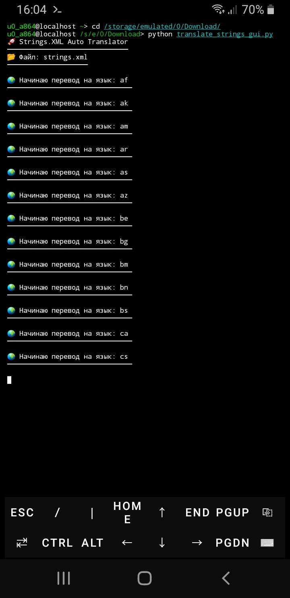
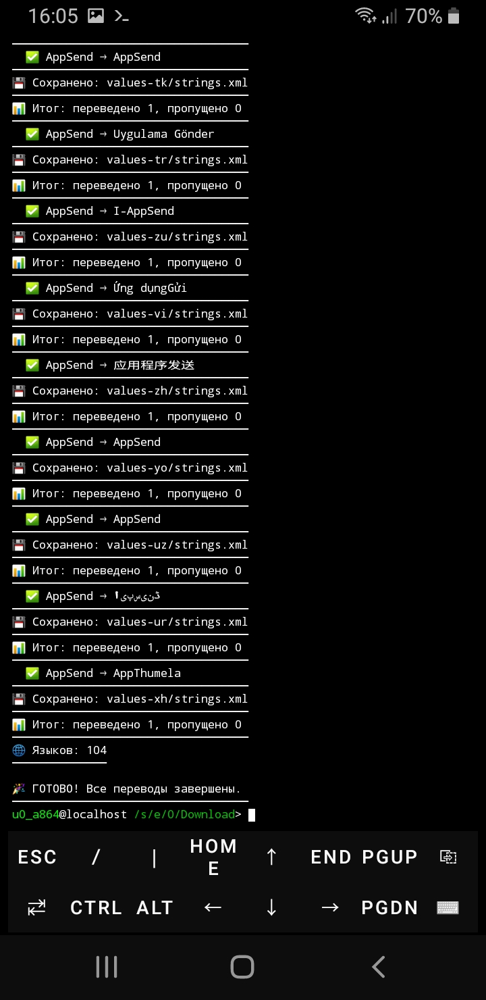
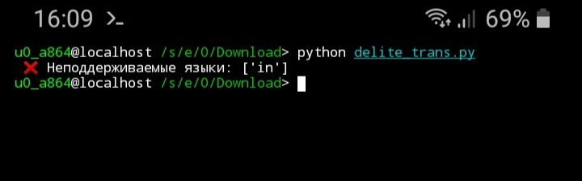

## TranslateStringsGui




## Strings.XML Auto Translator

```pip
pip install googletrans
```

* Modded by tojik_proof_93 @FlutterGenerator

## The Translation process in all countries of the world


